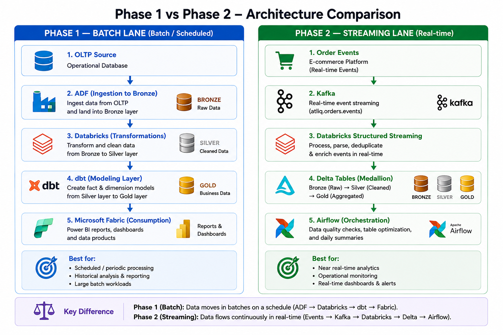

# AtliQ Commerce — End-to-End Data Engineering Pipeline

## 📌 Overview

An end-to-end data engineering project that syncs data from a live operational (OLTP) database into an analytics warehouse (OLAP), every night, and serves it through a Power BI dashboard in Microsoft Fabric — without ever touching the live application database for reporting.

> This is the **batch pipeline (Phase 1)**. For the companion real-time streaming lane, see [`streaming_pipeline_kafka`](./streaming_pipeline_kafka) — Phase 2.


## High-Level Architecture

The pipeline follows a **Bronze → Silver → Gold** medallion architecture:


## 📂 Table of Contents

- [Architecture Overview](#-architecture-overview)
- [Repository Structure](#-repository-structure)
- [Batch vs. Streaming](#-batch-vs-streaming)
- [Tech Stack](#️-tech-stack)
- [Data Model](#-data-model)
- [Implementation Walkthrough](#-implementation-walkthrough)
  - [1. OLTP Setup](#1-oltp-setup)
  - [2. Ingestion — Bronze Layer (Azure Data Factory)](#2-ingestion--bronze-layer-azure-data-factory)
  - [3. Transformation — Silver Layer (Databricks)](#3-transformation--silver-layer-databricks)
  - [4. Modeling — Gold Layer (dbt Core)](#4-modeling--gold-layer-dbt-core)
  - [5. Orchestration](#5-orchestration)
  - [6. Audit & Monitoring](#6-audit--monitoring)
  - [7. Reporting (Microsoft Fabric)](#7-reporting-microsoft-fabric)
  - [8. CI/CD](#8-cicd)
- [Idempotency](#-idempotency)
- [Timestamp Consistency](#-timestamp-consistency)
- [Getting Started](#️-getting-started)
- [Expected Outcome](#-expected-outcome)

## 🏗️ Architecture Overview

The core problem: running analytics queries directly against the live OLTP database slows down the application. This project solves it by maintaining two databases — a normalized OLTP store for transactions and a denormalized OLAP star schema for reporting — kept in sync by an automated nightly pipeline.

Data flows through three progressively cleaner layers:

- **Bronze** — raw, append-only landing zone in ADLS (Parquet), a faithful copy of the source
- **Silver** — cleaned, de-duplicated, governed Delta tables in Unity Catalog
- **Gold** — a denormalized star schema (fact + dimension tables) built with dbt, ready for reporting

## 📂 Repository Structure

The project is organized into folders by layer/responsibility, matching the architecture described above:

```
.
├── atliq_commerce_adf/          
│                                 
├── databricks_silver_transform/  
│                                 
├── atliq_dbt_gold/                
│                                 
├── fabric_analytics/             
│                                 
├── audit/                        
│                                 
├── streaming_pipeline_kafka/      
│                                 
├── .github/
│   └── workflows/                
└── README.md
```

| Folder | Purpose |
|---|---|
| `atliq_commerce_adf` | Ingestion layer — the generic, metadata-driven ADF pipeline that lands source data into Bronze |
| `databricks_silver_transform` | Transformation layer — Bronze to Silver PySpark notebooks, with the dbt Gold build chained in as a task in the same job |
| `atliq_dbt_gold` | Modeling layer — the dbt Core project that builds the Gold star schema from Silver |
| `fabric_analytics` | Reporting layer — the Fabric shortcut, semantic model, and Power BI report built on Gold |
| `audit` | Audit layer — DDL and supporting scripts for the pipeline run, ADF activity, and Databricks job audit tables |
| `streaming_pipeline_kafka` | A separate, minor Kafka-based streaming pipeline project, built independently of the main nightly batch pipeline |

---


## ⚖️ Batch vs. Streaming

The two approaches serve different business requirements.




| **Batch Processing**                                           | **Streaming Processing**                           |
| -------------------------------------------------------------- | -------------------------------------------------- |
| Data does not need to be available immediately.                | Events arrive continuously.                        |
| Daily or periodic reporting is sufficient.                     | The business needs frequently updated information. |
| Large volumes of data can be processed together.               | Operational monitoring is required.                |
| Business decisions are not dependent on real-time information. | Delays of hours are not acceptable.                |


Phase 2 therefore complements rather than replaces the Phase 1 batch pipeline. This project (Phase 1) covers the nightly batch sync described below; see [`streaming_pipeline_kafka`](./streaming_pipeline_kafka) for the real-time lane.

## 🛠️ Tech Stack

| Layer | Tool |
|---|---|
| OLTP database | Azure SQL Database |
| File storage | Azure Data Lake Storage Gen2 (ADLS) |
| Ingestion | Azure Data Factory (ADF) |
| Transformation | Azure Databricks (PySpark + Delta Lake, Unity Catalog) |
| Modeling | dbt Core (running on Databricks) |
| Reporting | Microsoft Fabric (Power BI) |
| Version control / CI | Git + GitHub (GitHub Actions) |

## 🧩 Data Model

**OLTP (3NF, built for writing)** — five normalized tables: `customers`, `products`, `orders`, `order_items`, `payments`. Each carries a watermark column (`updated_at` or `created_at` for insert-only `order_items`) that drives incremental extraction.

**OLAP (star schema, built for reading)**:

```
              dim_date
                 │
dim_customer ── fact_sales ── dim_product
```

| Table | Grain / role |
|---|---|
| `fact_sales` | One row per order item — `quantity`, `gross_revenue`, `item_price` |
| `dim_customer` | One row per customer — name, city, signup cohort |
| `dim_product` | One row per product — name, category, unit price, supplier cost, unit margin |
| `dim_date` | One row per calendar day — day, month, quarter, year, weekday |

## 🔄 Implementation Walkthrough

### 🗄️ 1. OLTP Setup

- Provisioned an **Azure SQL Database** and ran the schema and seed scripts in order to create and populate the five OLTP tables (`customers`, `products`, `orders`, `order_items`, `payments`), plus the **ETL control table** that drives ingestion.
- Provisioned an **ADLS Gen2** storage account with a source directory to hold the raw CSV inputs (supplier price list, marketing spend), alongside the SQL sources.

### 🥉 2. Ingestion — Bronze Layer (Azure Data Factory)

Built a single **generic, metadata-driven** ADF pipeline rather than one pipeline per table:

- **Linked Services** were created to Azure SQL, ADLS, and Databricks.
- A **Lookup** activity reads the ETL control table (watermark, table name, load type) to drive SQL extraction. A **ForEach** loop iterates over each table and branches by `load_type`:
  - **Incremental** tables are filtered by their watermark column and land in a dated `ingest_date=` folder in Bronze.
  - **Full** tables are reloaded completely each run.
- A separate **metadata (Get Metadata) activity** scans the storage source directory, filters for CSV files, and copies them into their respective Bronze target locations.
- **Retry-safe writes:** before every copy — for both full-load SQL tables and the CSV files, as well as for the specific incremental date partition — the target location is deleted first, then the copy runs. This means a retried run overwrites cleanly instead of appending duplicate data, for both full and incremental loads.
- Bronze remains raw, append-only Parquet — no cleaning or de-duplication happens at this stage.

### 🥈 3. Transformation — Silver Layer (Databricks)

Once ingestion completes, ADF triggers a **Databricks job** that transforms Bronze into Silver:

- **Full tables** (`customers`, `products`, CSV sources) are read fresh from their latest Bronze snapshot, cleaned, and written with an **overwrite** into Silver Delta tables in Unity Catalog.
- **Incremental tables** (`orders`, `order_items`, `payments`) are read from the current run's dated Bronze batch, collapsed to the latest version per business key, and **MERGE**d (upserted) into their Silver Delta tables. This is what keeps the load idempotent — re-running the same batch never produces duplicates.
- Silver tables are the governed, query-ready source of truth in Unity Catalog.

### 🥇 4. Modeling — Gold Layer (dbt Core)

A **dbt task**, chained after the Silver transformation within the same Databricks job, builds the Gold star schema:

- **Staging models** read from the Silver tables (declared as dbt `sources`) — thin, one-to-one models that avoid hardcoding table names anywhere downstream.
- **Mart models** (`fact_sales`, `dim_customer`, `dim_product`, `dim_date`) are built on top of staging and materialized as external Delta tables at a known ADLS path, so Fabric can read them directly.
- dbt **tests** (uniqueness, not-null, referential integrity between fact and dimension keys) act as data-quality gates — bad data fails the build rather than reaching the dashboard.

### 🔁 5. Orchestration

The Databricks job (Silver transformation + dbt Gold build, as chained tasks within one job) is triggered directly from the ADF pipeline once ingestion succeeds. The full chain — ADF ingest → Databricks Silver → dbt Gold — runs as a single nightly, end-to-end sequence.

### 🛡️ 6. Audit & Monitoring

A three-tier audit design tracks every run end to end:

| Table | Tracks |
|---|---|
| **Pipeline run audit** | One row per pipeline execution — the parent record, keyed by `pipeline_id` |
| **ADF activity audit** | Every ADF activity's success/failure for a given `pipeline_id` |
| **Databricks job audit** | Every Databricks job task's (Silver + dbt) success/failure for the same `pipeline_id` |

Both the ADF activity audit and the Databricks job audit tables reference the parent pipeline run via `pipeline_id`, giving full lineage from a single nightly run down to the specific step that succeeded or failed.

An **email alert** is configured on the Databricks job so that if any task fails, a failure notification is sent directly to the project owner's email, rather than relying on someone noticing a stale dashboard the next morning.

### 📊 7. Reporting (Microsoft Fabric)

- Gold tables are exposed to Fabric via a **OneLake shortcut** pointing at the Gold ADLS location — no data copy required.
- A **semantic model** was built on top of the shortcut, with relationships from `fact_sales` to each dimension table.
- A **Power BI report** was built on the semantic model to answer the core business questions (revenue trend, top products, top cities, new vs. returning customers).

### 🚀 8. CI/CD

- The dbt project's connection details are read from environment variables (no secrets committed), sourced from **GitHub Secrets** in CI.
- A **GitHub Actions workflow** validates the dbt project (`dbt build`) automatically whenever a pull request is raised from a feature branch, before code merges into main.

## 🔂 Idempotency

The pipeline is designed to produce identical results no matter how many times it runs for the same period:

- **Bronze:** target locations (full-load tables, CSVs, and the specific incremental date partition) are deleted before every write, so a retry overwrites instead of appending duplicates.
- **Silver:** incremental tables are upserted via Delta `MERGE` on their business key; full tables are overwritten wholesale.
- **Gold:** dbt models are rebuilt cleanly from Silver on each run.

Running the nightly job twice in a row produces the same row counts and the same `gross_revenue` totals.

## 🕒 Timestamp Consistency

Since timestamps are generated and compared across several different systems — Azure SQL, ADF, Databricks, and dbt — all watermark and audit timestamps are standardized to **UTC** throughout the pipeline. This avoids subtle bugs where a local time zone offset causes rows to be skipped or reprocessed incorrectly during the incremental watermark comparison.


## ▶️ Getting Started

### 1. Set up the OLTP source

Run the schema and seed scripts in `atliq_commerce_adf/sql/` (or equivalent) against a new Azure SQL Database to create and populate the source tables, plus the ETL control table.

### 2. Provision Azure resources

Create the ADLS Gen2 storage account, Azure Data Factory instance, and Databricks workspace (with Unity Catalog enabled). Set up Linked Services in ADF pointing to SQL, ADLS, and Databricks.

### 3. Deploy the ADF pipeline

Import the pipeline definitions from `atliq_commerce_adf/` into your Data Factory instance and configure the source/target datasets to match your storage account.

### 4. Configure the Databricks job

Deploy the notebooks from `databricks_silver_transform/` as a Databricks job with the Silver transformation and dbt Gold build chained as sequential tasks. Set up the email alert on job failure.

### 5. Configure dbt

Set up `atliq_dbt_gold/profiles.yml` (or environment variables) with your Databricks connection details, and confirm the `dbt build` runs cleanly against Silver.

### 6. Connect Fabric

Create a OneLake shortcut pointing at the Gold ADLS location, build the semantic model, and publish the Power BI report from `fabric_analytics/`.

### 7. Enable CI/CD

Add your Databricks connection details as GitHub Secrets, then confirm the GitHub Actions workflow in `.github/workflows/` runs `dbt build` automatically on pull requests.

---

## 🎯 Expected Outcome

At the end of the pipeline, the project provides:

* Automated, retry-safe nightly ingestion from Azure SQL and CSV sources into Bronze.
* Cleaned, deduplicated Silver Delta tables in Unity Catalog.
* A denormalized Gold star schema built and tested with dbt.
* Full run-level audit lineage across ADF activities and Databricks job tasks.
* Email alerts on Databricks job failure.
* A live Power BI report in Microsoft Fabric, sourced directly from Gold via a OneLake shortcut.
* CI validation of every dbt change before it merges.
* A complete, idempotent batch data engineering workflow using ADF, Databricks, dbt, and Fabric.
