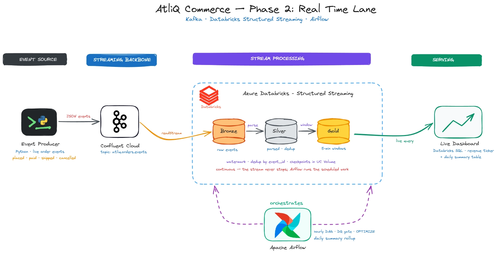
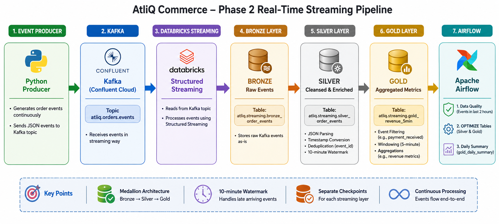

# AtliQ Commerce — Phase 2: Real-Time Streaming Pipeline

## 📌 Overview

Phase 2 extends the AtliQ Commerce data platform with a **real-time streaming lane** for continuously arriving order events.

Unlike a traditional batch pipeline, which processes data periodically, this solution uses **Apache Kafka, Databricks Structured Streaming, Delta Lake, and Apache Airflow** to ingest, process, validate, optimize, and summarize streaming order events.

The streaming pipeline is designed to operate alongside the Phase 1 batch pipeline, providing a faster path for operational and near-real-time analytics.

> This folder corresponds to `streaming_pipeline_kafka` in the parent AtliQ Commerce repository.

---
### High-Level Architecture




---
# 📂 Project Structure

```text
.
├── producer/
│   ├── order_event_producer.py
│   └── .env.example
│
├── databricks/
│   └── 01_kafka_stream_processing.py
│
├── airflow/
│   └── dags/
│       └── atliq_streaming_ops_dag.py
│
├── requirements.txt
│
└── README.md
```


## 🎯 Project Objectives

The main objectives of Phase 2 are:

* Build a real-time event ingestion pipeline using Kafka.
* Publish continuous order events from a Python producer.
* Process Kafka events using Databricks Structured Streaming.
* Implement a **Bronze → Silver → Gold** streaming architecture.
* Preserve raw events in Bronze.
* Parse, clean, deduplicate, and watermark events in Silver.
* Create aggregated business metrics in Gold.
* Maintain independent checkpoints for each streaming layer.
* Automatically execute the streaming notebook through a configured trigger.
* Implement Airflow-based data quality and operational maintenance.
* Generate a daily analytical summary from the streaming data.


# 🔄 End-to-End Data Flow

## 1. Kafka Setup

The first component of the pipeline is a Kafka environment hosted on **Confluent Cloud**. A Kafka cluster and topic are created to receive live order events.

### Kafka Topic
```text
atliq.orders.events
```

The Python producer publishes events continuously to this topic. Each event contains business information such as:

* `event_id`
* `event_type`
* `event_ts`
* `order_id`
* `customer_id`
* `product_id`
* `order_amount`
* `city`
* `payment_method`

The `event_id` provides a unique identifier for each event and is used for deduplication in the Silver layer.

The Kafka message key is based on `order_id`, which helps keep events belonging to the same order within the same Kafka partition and preserves their ordering within that partition.

---

# 🐍 2. Python Event Producer

A Python producer application is responsible for generating continuous order events.

The producer:

1. Creates order-related events.
2. Converts the events into JSON.
3. Publishes the events to the Kafka topic.
4. Uses `order_id` as the Kafka message key.
5. Continues producing events while the producer is running.

Once the producer is started, the events can be observed in the Confluent Cloud Kafka topic.

Example:

```text
Python Producer
      │
      │ JSON Events
      ▼
Kafka Topic
atliq.orders.events
```
---

# ⚡ 3. Databricks Structured Streaming

A Databricks notebook handles the complete streaming pipeline. The notebook processes the data through three independent layers:

Each layer has its own streaming query and its own checkpoint location. Separate checkpoints are important because checkpoints maintain the progress and state of individual streaming queries and therefore should not be shared between independent streams.

---

# 🥉 4. Bronze Layer

The Bronze layer captures the Kafka events in their raw form.

### Source

```text
Kafka Topic - atliq.orders.events
```

### Target

```text
atliq.streaming.bronze_order_events
```

The Bronze stream reads directly from Kafka using Databricks Structured Streaming. The raw Kafka information is preserved, including fields such as:

* Kafka key
* Kafka value
* topic
* partition
* offset
* Kafka timestamp

No business-level JSON parsing or transformation is performed at this stage. This layer acts as the raw landing layer and provides traceability back to the original Kafka events.

---

# 🥈 5. Silver Layer

The Silver layer reads the streaming data from the Bronze table and performs data preparation and cleansing.

### Main Transformations

#### JSON Parsing

The raw JSON payload is parsed using an explicit schema. The required business fields are extracted from the JSON event.

#### Timestamp Conversion

The event timestamp is converted into an appropriate Spark timestamp type for event-time processing.

#### Deduplication

Duplicate events are removed using:

```text
event_id
```

#### Watermarking

A **10-minute watermark** is applied to the event timestamp.

Watermarking allows the streaming pipeline to handle reasonably late-arriving events while allowing Spark to eventually clean up old streaming state.

### Target

```text
atliq.streaming.silver_order_events
```
---

# 🥇 6. Gold Layer

The Gold layer contains business-oriented streaming aggregations derived from the Silver data. The Gold aggregation uses event-time windows to summarize streaming activity.
The requirements specify aggregation of `payment_received` events into **5-minute windows**.

The Gold layer contains:

```text
atliq.streaming.gold_revenue_5min
```


### Why Gold Results Can Appear Late

Gold results are not necessarily available immediately after an event arrives. A window is emitted after the window closes and the watermark advances beyond the window's end time.
Because the Silver layer uses a 10-minute watermark, Gold results can therefore appear behind real time. This delay is expected and allows the pipeline to accommodate late-arriving events.

---

# 🔁 7. Automated Streaming Execution

The Databricks notebook has a configured trigger so that the streaming processing is executed automatically rather than requiring the notebook to be manually started for every batch of incoming events.

As new events continue to arrive in Kafka:

```text
Kafka Events
     │
     ▼
Streaming Notebook
     │
     ├── Bronze updated
     ├── Silver updated
     └── Gold updated
```

This allows the streaming tables to continuously reflect newly arriving events. The trigger configuration is an operational setting and is independent of the core Bronze/Silver/Gold transformation logic.

---

# 🛡️ 8. Airflow Orchestration

Apache Airflow is used for operational management of the streaming pipeline. The DAG runs on a scheduled basis (e.g. hourly), which pairs with the 2-hour lookback in the freshness check below — giving each run at least one full cycle of buffer before a genuinely stale pipeline gets flagged.

The Airflow DAG handles three major responsibilities:

```text
                Airflow DAG
                    │
       ┌────────────┼────────────┐
       ▼            ▼            ▼
 Data Quality    Optimize    Daily Summary
    Check        Tables         Refresh
```

The three tasks are executed sequentially. The project requirements specify that the DAG performs these tasks on a scheduled basis.

---

## 8.1 Data Quality / Freshness Check

The first Airflow task verifies whether streaming events have been received recently. The check looks for events within the **previous two hours**.

### Expected behavior

```text
Events received in last 2 hours?
          │
      ┌───┴───┐
     YES      NO
      │        │
      ▼        ▼
 Continue    Fail DAG
```

If events are present, the pipeline proceeds to the next task. If no events have arrived during the required period, the data-quality task fails.
This acts as a freshness gate and helps identify problems such as a stopped producer or interrupted ingestion pipeline.

---

## 8.2 Optimize Silver and Gold Tables

The second Airflow task performs table maintenance. Streaming workloads can create many small files over time. Therefore, the Silver and Gold tables are periodically optimized using Delta Lake's `OPTIMIZE` command (compacting small files into larger ones), with `VACUUM` used separately to clean up stale, unreferenced data files.
This helps maintain efficient storage and query performance as the volume of streaming data grows.

---

## 8.3 Daily Summary Table

The third Airflow task creates or refreshes a daily analytical summary. The summary provides daily business metrics such as:

* Orders placed
* Orders paid
* Orders cancelled
* Revenue

Target table:

```text
gold_daily_summary
```

This provides a convenient table for daily-level analysis without requiring users to repeatedly aggregate the underlying streaming data.

---

# 🔗 Complete Pipeline





# 🔐 Security Considerations

Kafka credentials and other sensitive configuration values should not be committed to the repository.

Use an environment file locally:

```text
.env
```

and provide only a template in GitHub:

```text
.env.example
```

The `.env` file should be included in `.gitignore`.

Never commit:

* Kafka API keys
* Kafka API secrets
* Databricks credentials
* Access tokens
* Other sensitive connection information

---

# 📊 Validation and Monitoring

The implementation includes multiple validation points.

### Kafka Validation

Confirm that events are successfully published to:

```text
atliq.orders.events
```

and are visible in the Confluent Cloud topic.

### Databricks Validation

Verify that records are flowing through:

```text
Bronze → Silver → Gold
```

and that the corresponding streaming tables are being updated.

### Airflow Validation

Verify that:

1. The complete DAG executes successfully.
2. The freshness check detects recent events.
3. Silver and Gold tables are optimized.
4. The daily summary table is refreshed.
5. The freshness check fails when event ingestion becomes stale.

The requirements specifically use stopping the producer and triggering the DAG as a validation scenario for the freshness check.


# 💡 Key Design Decisions

### 1. Kafka as the Event Streaming Layer

Kafka decouples event generation from downstream processing and provides a scalable mechanism for continuously ingesting events.

### 2. Medallion Architecture

The Bronze/Silver/Gold structure separates:

```text
Raw Data
   ↓
Cleaned & Prepared Data
   ↓
Business-Level Analytics
```

This improves maintainability, traceability, and downstream usability.

### 3. `event_id` for Deduplication

`event_id` uniquely identifies an event and is therefore used to prevent duplicate events from entering the Silver layer.

### 4. `order_id` as Kafka Key

Using `order_id` as the Kafka key helps ensure that events belonging to the same order are routed to the same partition, preserving ordering within that partition.

### 5. Watermarking

A 10-minute watermark provides a balance between allowing late-arriving events and allowing the streaming engine to advance and clean up state.

### 6. Independent Checkpoints

Bronze, Silver, and Gold each use separate checkpoint locations to independently maintain streaming progress and state.

### 7. Airflow for Operational Management

Airflow separates operational concerns from the core streaming transformations by handling:

```text
Freshness → Maintenance → Daily Rollup
```

---

# 🛠️ Technology Stack

| Component           | Technology                      |
| ------------------- | ------------------------------- |
| Event Producer      | Python                          |
| Event Streaming     | Apache Kafka                    |
| Kafka Platform      | Confluent Cloud                 |
| Stream Processing   | Databricks Structured Streaming |
| Storage             | Delta Lake / Unity Catalog      |
| Data Architecture   | Medallion Architecture          |
| Orchestration       | Apache Airflow                  |
| Airflow Environment | Docker / Local                  |
| Programming         | Python / PySpark                |
| Version Control     | Git / GitHub                    |

---

# ▶️ Getting Started

### 1. Install dependencies

```bash
pip install -r requirements.txt
```

### 2. Configure Kafka credentials

Copy the environment template and fill in your Confluent Cloud credentials:

```bash
cp producer/.env.example producer/.env
```

Then edit `producer/.env` with your Kafka bootstrap server, API key, and API secret. This file is git-ignored and should never be committed.

### 3. Start the event producer

```bash
python producer/order_event_producer.py
```

This begins publishing simulated order events continuously to the `atliq.orders.events` Kafka topic. Leave it running to keep the streaming pipeline fed.

### 4. Run the Databricks streaming notebook

Import `databricks/01_kafka_stream_processing.py` into your Databricks workspace, attach it to a cluster with access to the Kafka credentials, and run it (or attach the configured trigger for automatic execution). This starts the Bronze → Silver → Gold streaming queries.

### 5. Deploy the Airflow DAG

Place `airflow/dags/atliq_streaming_ops_dag.py` in your Airflow `dags/` folder (Docker or local Airflow environment) and enable the DAG. It will run on its configured schedule, performing the freshness check, table optimization, and daily summary refresh.

---

# 🚀 Expected Outcome

At the end of the pipeline, the project provides:

* Continuous Kafka-based event ingestion.
* Raw event storage in Bronze.
* Cleaned and deduplicated streaming data in Silver.
* Watermarked event-time processing.
* Near-real-time business aggregations in Gold.
* Automated streaming execution.
* Data freshness monitoring.
* Periodic optimization of streaming tables.
* Daily business-level summary data.
* A complete real-time data engineering workflow using Kafka, Databricks, Delta Lake, and Airflow.

---

# 📝 Conclusion

This Phase 2 implementation demonstrates an end-to-end **real-time data engineering architecture**.

The solution combines event generation, Kafka-based ingestion, Databricks Structured Streaming, Medallion architecture, Delta Lake storage, watermarking, deduplication, windowed aggregations, and Airflow-based operational orchestration.

The result is a scalable streaming lane capable of processing continuously arriving order events while maintaining data quality, performance, and analytical usability.