# Atliq Commerce Data Pipeline — Execution Walkthrough

This walkthrough uses execution screenshots to document the end-to-end pipeline from ingestion through transformation, validation, and the Gold analytical model.

## 1. ADF activity-run view

> ADF activity-run view showing the ingestion pipeline completed successfully across its metadata, control-table, copy, and Databricks activities.

## 2. Kafka lineage

> Kafka lineage showing the order-event producer publishing to `atliq.orders.events`, which is consumed by the Spark Kafka consumer.

## 3. Pipeline audit output capturing the pipeline run ID, run date, pipeline name, and execution timestamp for traceability.

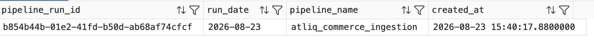

> Pipeline audit output capturing the pipeline run ID, run date, pipeline name, and execution timestamp for traceability.

## 4. Gold `dim_products` query result

> Gold `dim_products` query result showing product attributes, pricing, supplier cost, and calculated unit margin.

## 5. Control table defining full versus incremental loading and the watermark column used for each source table.

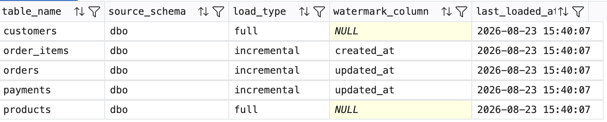

> Control table defining full versus incremental loading and the watermark column used for each source table.

## 6. Gold `dim_date` query result

> Gold `dim_date` query result showing calendar attributes such as year, quarter, month, week, and day.

## 7. ADF pipeline design

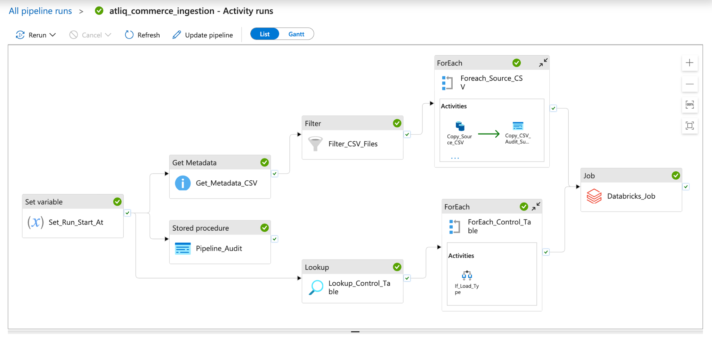

> ADF pipeline design showing metadata discovery, control-table processing, CSV handling, and the Databricks job invocation.

## 8. ADF Trigger Runs view confirming that the `atliq_trigger` schedule trigger executed successfully.

> ADF Trigger Runs view confirming that the `atliq_trigger` schedule trigger executed successfully.

## 9. Detailed ADF pipeline flow

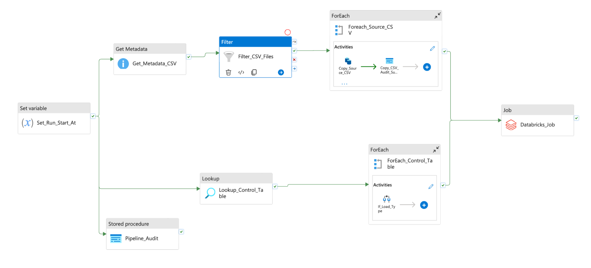

> Detailed ADF pipeline flow showing the full-load/incremental-load decision path and CSV processing before Databricks execution.

## 10. Schedule-trigger configuration

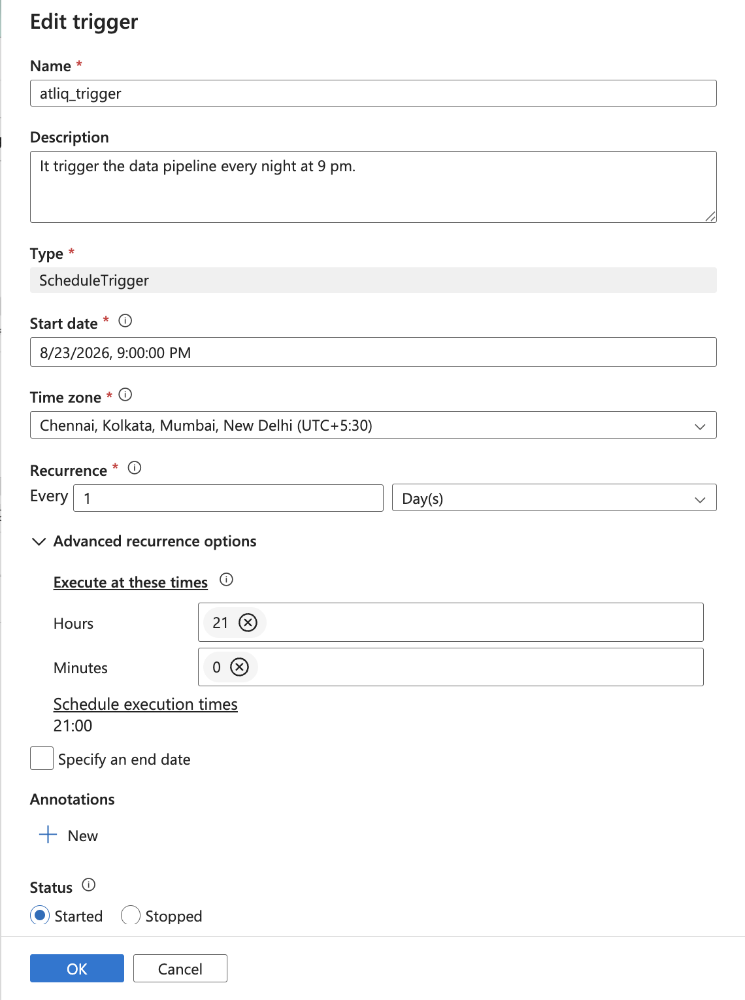

> Schedule-trigger configuration showing daily execution at 9:00 PM in the India time zone.

## 11. Gold dimensional model

> Gold dimensional model showing `fact_sales` connected to the customer, product, and date dimensions.

## 12. Gold `dim_customers` query result

> Gold `dim_customers` query result showing customer keys and descriptive customer attributes.

## 13. Bronze storage view

> Bronze storage view showing the order data partitioned by `ingest_date=2026-08-23`.

## 14. Gold model view highlighting the star-schema relationships between the sales fact and its dimensions.

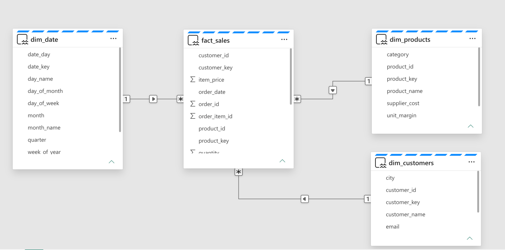

> Gold model view highlighting the star-schema relationships between the sales fact and its dimensions.

## 15. Bronze storage view listing the ingested source datasets such as customers, orders, products, payments, and supporting files.

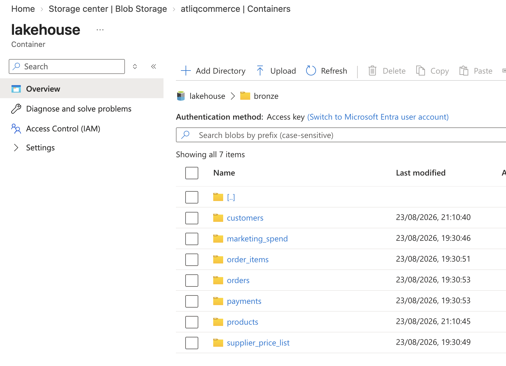

> Bronze storage view listing the ingested source datasets such as customers, orders, products, payments, and supporting files.

## 16. Silver-layer validation query

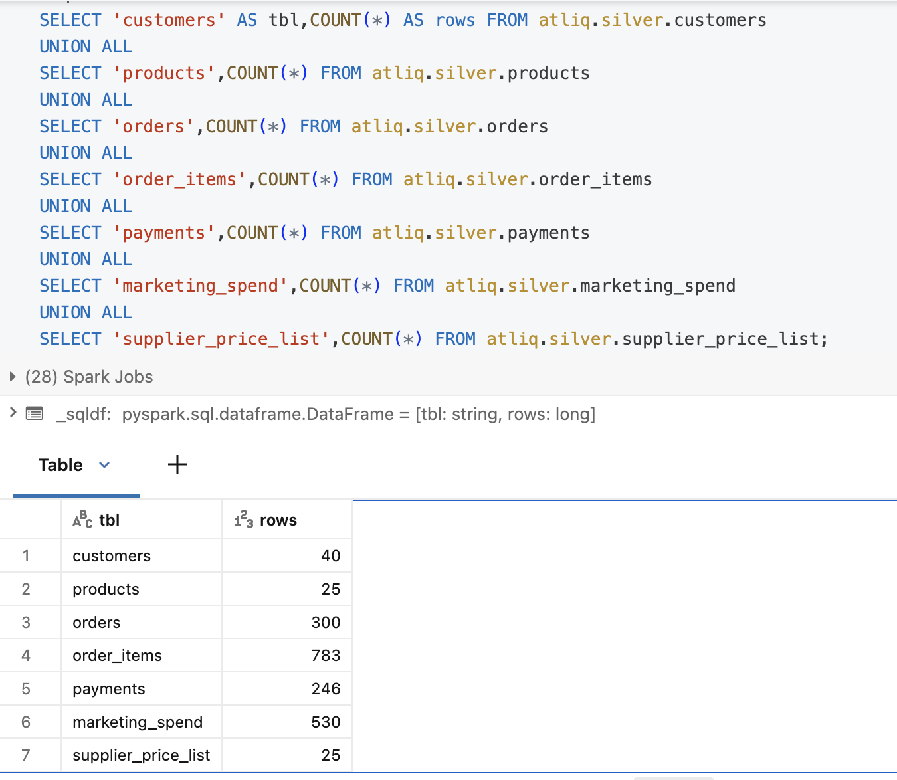

> Silver-layer validation query showing row counts for customers, products, orders, order items, payments, marketing spend, and supplier price list.

## 17. Databricks transformation job graph

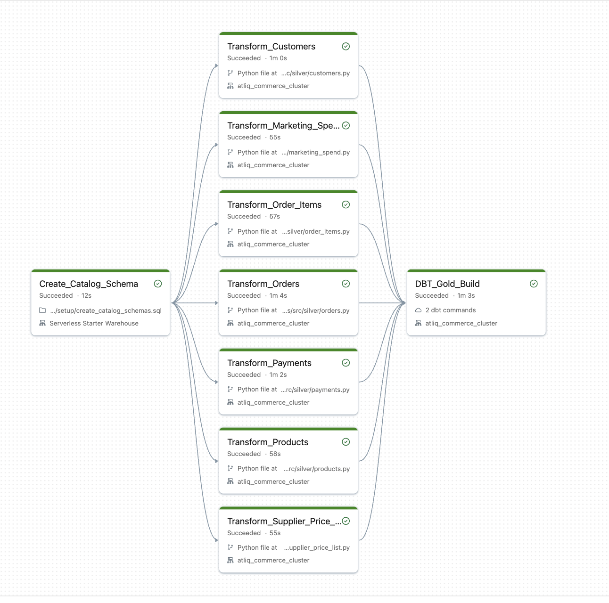

> Databricks transformation job graph showing successful Silver transformations followed by the Gold dbt build.

## 18. Databricks job run view confirming successful execution of the transformation workflow.

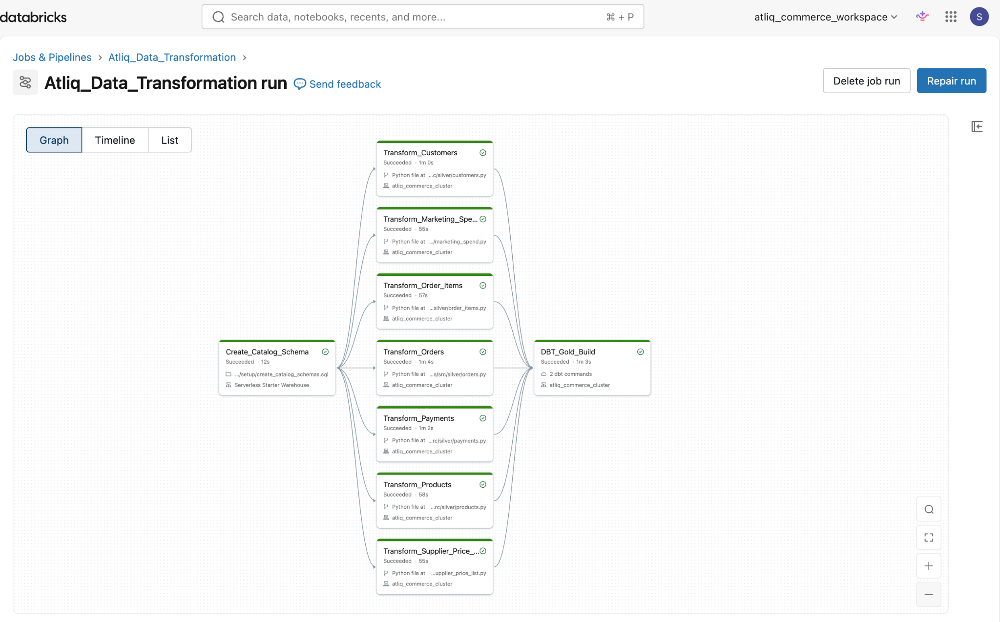

> Databricks job run view confirming successful execution of the transformation workflow.

## 19. Compact Silver validation result confirming the processed record counts for the main transactional tables.

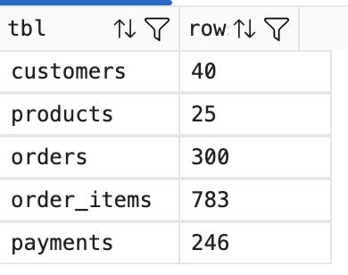

> Compact Silver validation result confirming the processed record counts for the main transactional tables.

## 20. Additional ADF execution evidence confirming successful activity completion for the ingestion pipeline.

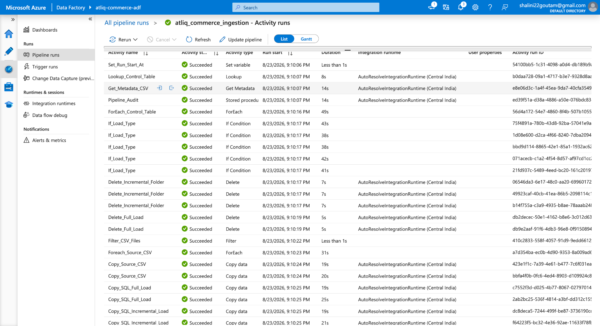

> Additional ADF execution evidence confirming successful activity completion for the ingestion pipeline.

## End-to-End Flow

The screenshots collectively demonstrate the flow:

**Source systems → Azure Data Factory → Bronze → Databricks/Silver → dbt Gold → Analytical model**

A separate streaming path is also shown:

**Kafka producer → `atliq.orders.events` → Spark Kafka consumer**
